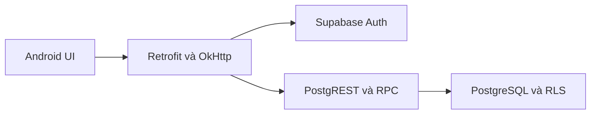

# HaUI Classroom Management

Ứng dụng Android hỗ trợ sinh viên tìm và đăng ký sử dụng phòng học, đồng thời giúp quản trị viên quản lý phòng, duyệt yêu cầu, quản lý người dùng, theo dõi thống kê và xử lý sự cố.

Backend của ứng dụng sử dụng **Supabase Auth**, **PostgreSQL**, **PostgREST** và **RPC**.

> README này mô tả mã nguồn trong `Phonghochaui_new.zip` tại ngày 31/08/2026. Chức năng **lịch học chính khóa** không thuộc phạm vi sản phẩm hiện tại. Mục **Lịch** của sinh viên là lịch sử yêu cầu đặt phòng.

## Chức năng chính

### Sinh viên

- Đăng nhập bằng email và mật khẩu Supabase.
- Tìm kiếm và lọc phòng theo cơ sở, tòa nhà, sức chứa và trạng thái.
- Xem thông tin phòng học.
- Gửi yêu cầu sử dụng phòng theo ngày, khung giờ, số người và mục đích.
- Xem lịch sử yêu cầu đặt phòng.
- Lọc yêu cầu theo trạng thái:
  - `pending`: Chờ duyệt.
  - `approved`: Đã duyệt.
  - `rejected`: Bị từ chối.
  - `cancelled`: Đã hủy.
- Xem ghi chú của quản trị viên.
- Xem và đánh dấu thông báo đã đọc.
- Gửi báo cáo sự cố phòng học.
- Đăng xuất.

Thanh điều hướng dưới của sinh viên hiện có 4 mục:

1. Trang chủ.
2. Đăng ký.
3. Lịch — lịch sử đặt phòng.
4. Thông báo.

### Quản trị viên

- Xem số yêu cầu đặt phòng đang chờ trên trang chủ.
- Quản lý phòng học: xem, tìm kiếm, lọc, thêm, sửa và xóa.
- Duyệt hoặc từ chối yêu cầu đặt phòng.
- Nhập ghi chú khi từ chối yêu cầu.
- Quản lý tài khoản và khóa/mở khóa người dùng.
- Xem dashboard thống kê phòng, người dùng và yêu cầu đặt phòng.
- Xem và xử lý báo cáo sự cố.
- Chuyển phòng sang bảo trì khi tiếp nhận sự cố.
- Chuyển phòng về hoạt động khi sự cố được giải quyết.
- Đăng xuất.

## Công nghệ sử dụng

| Thành phần | Công nghệ/phiên bản |
|---|---|
| Ngôn ngữ | Java 11 |
| Giao diện | Android XML, Material Components |
| Điều hướng sinh viên | Navigation Component, Fragment, BottomNavigationView |
| Điều hướng admin | Activity |
| Backend | Supabase |
| Database | PostgreSQL |
| API | Supabase Auth, PostgREST, RPC |
| HTTP client | Retrofit 3.0.0, OkHttp 4.12.0 |
| JSON | Gson |
| Gradle | 8.13 |
| Android Gradle Plugin | 8.13.2 |
| Android tối thiểu | API 24 — Android 7.0 |
| Compile/Target SDK | API 36 |

## Kiến trúc tổng quát



- Activity và Fragment xử lý giao diện.
- `SupabaseApiService` khai báo các endpoint REST/RPC.
- `RetrofitClient` tạo HTTP client dùng chung.
- `SupabaseInterceptor` tự động gắn API key và access token.
- `SupabaseAuthenticator` làm mới access token khi gặp HTTP 401.
- `SessionManager` lưu token, UUID, email và vai trò bằng SharedPreferences.

## Cấu trúc thư mục

```text
Phonghochaui/
├── app/
│   ├── build.gradle.kts
│   └── src/
│       ├── main/
│       │   ├── AndroidManifest.xml
│       │   ├── java/com/example/phonghochaui/
│       │   │   ├── data/model/      # Model dữ liệu
│       │   │   ├── data/remote/     # Retrofit, Supabase, session
│       │   │   ├── adapter/         # RecyclerView Adapter
│       │   │   ├── ui/              # Fragment và biểu đồ
│       │   │   └── *.java           # Activity, Fragment, Adapter
│       │   └── res/                  # Layout, string, icon, menu
│       ├── test/                     # Unit test
│       └── androidTest/              # Instrumented test
├── gradle/
├── build.gradle.kts
├── settings.gradle.kts
├── local.properties.example
└── SETUP_SUPABASE.md
```

## Yêu cầu cài đặt

- Android Studio hỗ trợ AGP 8.13.2.
- JDK 17 được khuyến nghị để chạy Gradle.
- Android SDK Platform 36.
- Thiết bị thật hoặc máy ảo từ Android 7.0/API 24.
- Kết nối Internet.
- Một Supabase project đã có bảng, RLS và RPC tương thích.

## Cấu hình Supabase

### 1. Lấy URL và key

Trong Supabase Dashboard, mở **Project Settings > API Keys** và lấy:

- Project URL.
- Publishable key hoặc legacy `anon` key.

Không sử dụng `service_role`, secret key hoặc mật khẩu database trong ứng dụng Android.

### 2. Cập nhật `local.properties`

Giữ dòng `sdk.dir` do Android Studio tạo và thêm:

```properties
sdk.dir=/duong-dan/toi/Android/Sdk
SUPABASE_URL=https://YOUR_PROJECT_REF.supabase.co/
SUPABASE_PUBLISHABLE_KEY=sb_publishable_xxxxxxxxxxxxxxxxxxxx
```

Không đặt URL hoặc key trong dấu ngoặc kép. Không commit `local.properties` lên Git.

### 3. Chuẩn bị tài khoản

1. Tạo người dùng trong **Supabase Authentication**.
2. Lấy UUID của người dùng.
3. Tạo bản ghi trong `public.profiles` với `id` trùng UUID.
4. Đặt `role` là:
   - `student` cho sinh viên.
   - `admin` cho quản trị viên.

Ứng dụng không chấp nhận vai trò khác.

### 4. Cấu hình database

Mã nguồn hiện không kèm bộ migration SQL đầy đủ để tạo một Supabase project mới từ đầu. Backend cần có sẵn các bảng, khóa ngoại, RLS policy và RPC bên dưới.

## Các bảng dữ liệu chính

| Bảng | Mục đích |
|---|---|
| `profiles` | Hồ sơ, mã HaUI, họ tên, vai trò và trạng thái khóa. |
| `campuses` | Danh sách cơ sở. |
| `buildings` | Danh sách tòa nhà thuộc cơ sở. |
| `classrooms` | Phòng, tầng, sức chứa và trạng thái vận hành. |
| `room_bookings` | Yêu cầu sử dụng phòng của sinh viên. |
| `notifications` | Thông báo theo người dùng. |
| `incident_reports` | Báo cáo và trạng thái xử lý sự cố. |

Các quan hệ quan trọng:

- `buildings.campus_id -> campuses.id`.
- `classrooms.building_id -> buildings.id`.
- `room_bookings.user_id -> profiles.id`.
- `room_bookings.classroom_id -> classrooms.id`.
- `notifications.user_id -> profiles.id`.
- `incident_reports.user_id -> profiles.id`.
- `incident_reports.classroom_id -> classrooms.id`.

Trạng thái được ứng dụng sử dụng:

| Dữ liệu | Giá trị |
|---|---|
| Phòng | `active`, `maintenance`, `inactive` |
| Yêu cầu đặt phòng | `pending`, `approved`, `rejected`, `cancelled` |
| Sự cố | `pending`, `processing`, `resolved` |
| Mức ưu tiên | `low`, `medium`, `high` |
| Vai trò | `student`, `admin` |

## RPC chính

| RPC | Mục đích |
|---|---|
| `student_create_room_booking_v1` | Sinh viên tạo yêu cầu sử dụng phòng. |
| `admin_list_room_bookings_v1` | Admin tải và lọc yêu cầu. |
| `admin_review_room_booking_v1` | Admin duyệt hoặc từ chối yêu cầu. |
| `admin_create_classroom_v1` | Thêm phòng. |
| `admin_update_classroom_v1` | Sửa phòng. |
| `admin_delete_classroom_v1` | Xóa phòng. |
| `admin_list_users_v1` | Liệt kê người dùng. |
| `admin_set_user_locked_v1` | Khóa hoặc mở khóa người dùng. |
| `admin_get_dashboard_statistics_v1` | Trả dữ liệu thống kê. |

Sau khi tạo hoặc sửa chữ ký RPC, chạy:

```sql
notify pgrst, 'reload schema';
```

## Chạy ứng dụng

1. Mở thư mục dự án trong Android Studio.
2. Cấu hình `local.properties`.
3. Chọn **Sync Project with Gradle Files**.
4. Chọn **Build > Clean Project**.
5. Chọn **Build > Rebuild Project**.
6. Chọn thiết bị hoặc máy ảo.
7. Nhấn **Run**.

Màn hình khởi động là `LoginActivity`. Sau khi đăng nhập, ứng dụng đọc `profiles.role` để mở giao diện sinh viên hoặc admin.

## Build bằng dòng lệnh

macOS/Linux:

```bash
chmod +x gradlew
./gradlew clean assembleDebug
```

Windows:

```powershell
.\gradlew.bat clean assembleDebug
```

APK debug được tạo tại:

```text
app/build/outputs/apk/debug/app-debug.apk
```

Chạy test:

```bash
./gradlew testDebugUnitTest
./gradlew connectedDebugAndroidTest
```

Hiện dự án mới chỉ có test mẫu, chưa có bộ kiểm thử nghiệp vụ đầy đủ.

## Bảo mật

- Bật RLS cho các bảng có dữ liệu người dùng.
- Sinh viên chỉ được đọc booking và thông báo của chính mình.
- Chỉ admin được gọi RPC quản trị.
- RPC phải kiểm tra `auth.uid()` và vai trò ở backend.
- Việc kiểm tra xung đột thời gian đặt phòng phải thực hiện trong PostgreSQL/RPC.
- Không đưa `service_role`, database password hoặc keystore vào mã nguồn.
- Khi chia sẻ ZIP, loại bỏ `local.properties`, `.git`, APK và tệp chứa thông tin bí mật.

## Lỗi thường gặp

### Supabase chưa được cấu hình

Kiểm tra `SUPABASE_URL`, `SUPABASE_PUBLISHABLE_KEY`, sau đó Sync lại Gradle.

### Đăng nhập được nhưng không vào trang chủ

Kiểm tra:

- `profiles.id` có trùng `auth.users.id` hay không.
- `profiles.role` có đúng `student` hoặc `admin` hay không.
- RLS có cho người dùng đọc hồ sơ của chính mình hay không.

### PGRST202 hoặc không tìm thấy RPC

- So sánh tên tham số `p_*` trong Android với chữ ký function.
- Kiểm tra quyền `execute`.
- Chạy `notify pgrst, 'reload schema';`.
- Clean/Rebuild ứng dụng.

### Danh sách không có dữ liệu

- Kiểm tra RLS và `auth.uid()`.
- Kiểm tra khóa ngoại dùng cho dữ liệu nhúng.
- Kiểm tra filter và trạng thái trong database.
- Kiểm tra bản ghi có thuộc tài khoản đang đăng nhập hay không.

### `./gradlew: Permission denied`

```bash
chmod +x gradlew
```

## Lưu ý về mã nguồn hiện tại

- Chức năng lịch học chính khóa đã được bỏ khỏi phạm vi sản phẩm.
- Một số file và API lịch học cũ vẫn còn trong mã nguồn; có thể xóa sau khi xác nhận không còn phụ thuộc.
- `nav_student_schedule` đang mở lịch sử đặt phòng, tên ID này chỉ là tên cũ.
- Bottom Navigation của sinh viên hiện có 4 mục; admin chưa có Bottom Navigation.
- Trạng thái của từng tab sinh viên chưa được giữ khi chuyển tab.
- Dự án đang khai báo hai phiên bản AndroidX Navigation; nên thống nhất về một phiên bản.
- Xử lý sự cố hiện cập nhật sự cố và phòng bằng hai request riêng, chưa phải một transaction.
- Chức năng tải ảnh sự cố chưa được triển khai.
- Repository chưa có migration Supabase đầy đủ và chưa có cấu hình ký release.

## Giấy phép

Repository hiện chưa có tệp `LICENSE`. Cần bổ sung giấy phép trước khi phát hành mã nguồn công khai hoặc cho phép bên khác sử dụng/phân phối.

---

Khi thay đổi bảng, RPC hoặc luồng nghiệp vụ, nên cập nhật README và migration SQL trong cùng phiên bản để mã Android luôn khớp với Supabase.
